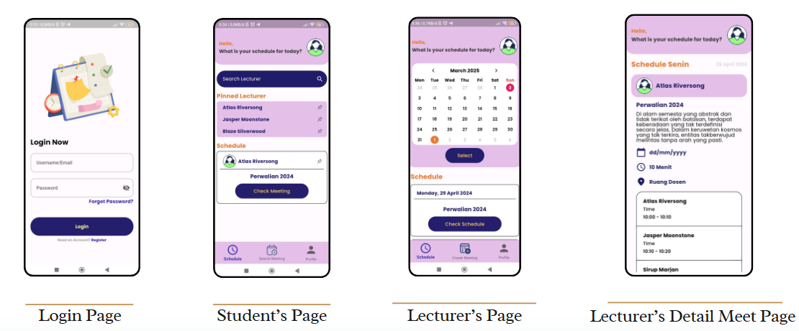

# MeetSync 📅  
MeetSync is a mobile application designed to simplify and streamline the process of scheduling meetings between students and lecturers. By allowing lecturers to input their available times and enabling students to view and book those slots easily, MeetSync aims to reduce the hassle of coordinating academic consultations.

## 📱 Features
- Lecturer schedule management  
- Student-friendly meeting booking system  
- Real-time schedule viewing  
- Authentication and role-based access  
- Clean, responsive UI built with Flutter  

## 🎯 Purpose & Background  
This project was built as a final team project during my involvement in the Mobile Development division at **ITC (Informatics Technology Club)**, a tech community at my university. Although the team consisted of multiple roles (PM, UI/UX, and developers), I fully handled the mobile app development — from setting up the project architecture to implementing features and ensuring seamless UX using Flutter.

## 💡 Tech Stack
- **Flutter** – Mobile app development  
- **Firebase** *(optional or planned)* – For authentication and data storage  
- **Figma** – UI/UX design (collaborated with the designer)  

## 🚀 Getting Started
### Prerequisites
- Flutter SDK installed  
- An emulator or physical device

### Installation
1. Clone the repository:
   ```bash
   git clone https://github.com/AdhiKrisna/MeetSync.git

## 📸 Screenshots  

